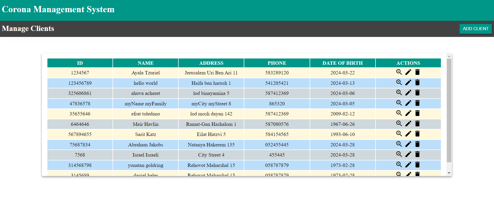
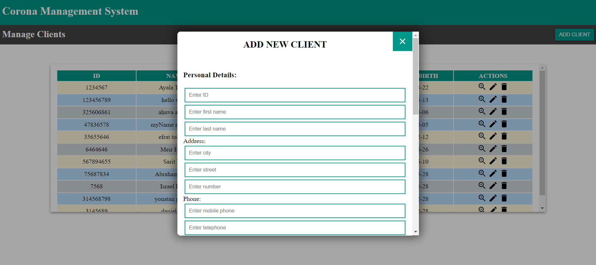
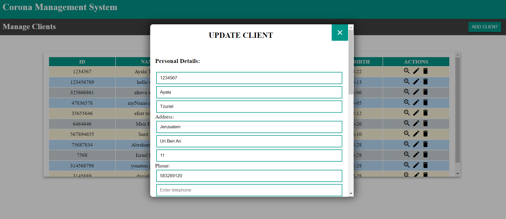
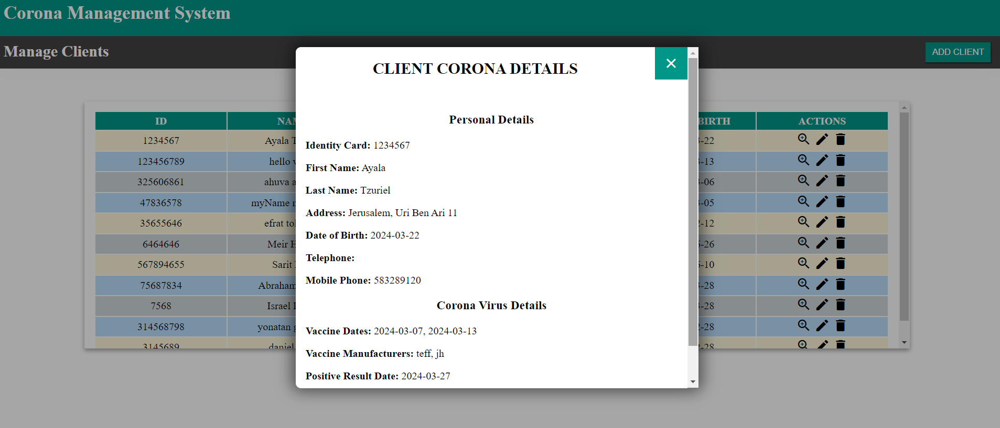
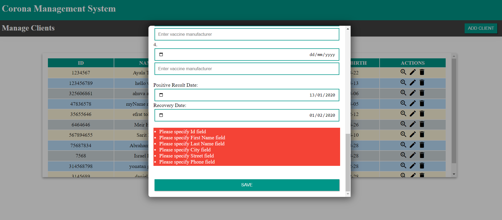
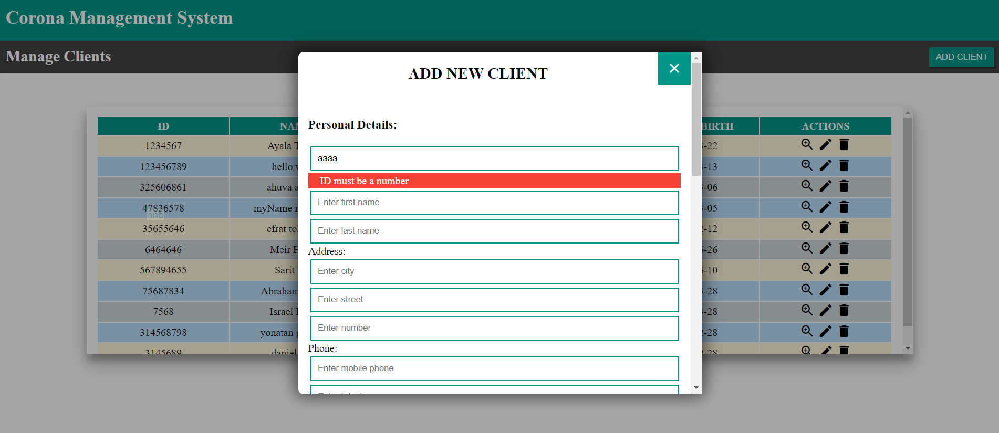
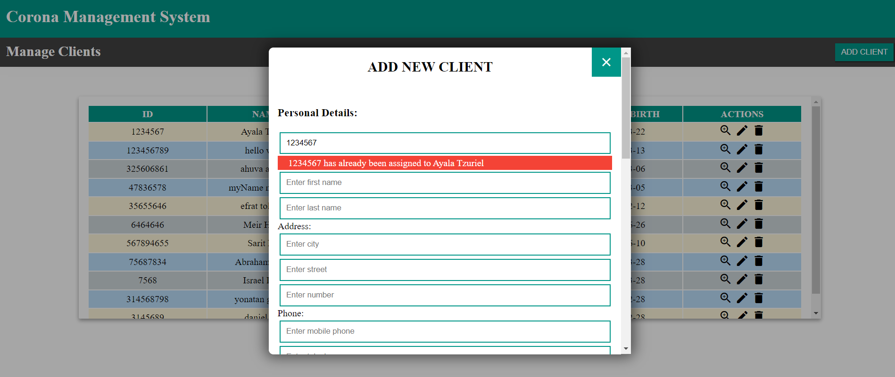

# Corona Management System

This is a web application designed to manage client information for a corona management system. It provides functionality to add, update, delete, and view client details including personal information and corona virus related details.

## Author:

Ayala Tzuriel

## Table of Contents

- [Introduction](#introduction)
- [Features](#features)
- [Installation](#installation)
- [Usage](#usage)
- [REST API](#rest-api)
- [Dependencies](#dependencies)
- [Contributing](#contributing)
- [License](#license)
- [Screenshots](#screenshots)

## Introduction

The Corona Management System is built to help healthcare professionals manage client data efficiently. It offers an intuitive interface for adding new clients, updating existing information, deleting records, and viewing client details. The system also allows tracking corona virus related details such as vaccine dates, vaccine manufactors, positive result date, and recovery date.

## Features

- **Add Client**: Easily add new clients to the system by filling in their personal details and corona virus related information.
- **Update Client**: Update existing client information including personal details and corona virus related data.
- **Delete Client**: Remove clients from the system when necessary.
- **View Client Details**: View detailed information about each client including personal and corona virus related details.

## Installation

To run the Corona Management System locally, follow these steps:

1. Clone this repository to your local machine.
2. Ensure you have Node.js and npm installed.
3. Navigate to the `server` directory and run `npm install` to install server dependencies.
4. Start the server by running `npm start`.
5. Navigate to the `client` directory and open `index.html` in a web browser.

## Usage

- Upon opening the application, you'll see a table displaying existing client information.
- Use the "ADD CLIENT" button to add a new client.
- Click on the edit icon to update client details.
- Click on the delete icon to remove a client from the system.
- Click on the plus icon to view additional details of a client's corona virus information.

## REST API

The Corona Management System includes a RESTful API connected to MongoDB for storing, retrieving, deleting, and updating client data. The API endpoints include:

- **GET /clients**: Retrieves all clients stored in the database.
- **POST /clients**: Adds a new client to the database.
- **GET /clients/{clientId}**: Retrieves a specific client by ID.
- **PATCH /clients/{clientId}**: Updates an existing client's information.
- **DELETE /clients/{clientId}**: Deletes a client from the database by ID.

## Dependencies

- Express.js: Web application framework for the server-side application.
- Mongoose: MongoDB object modeling tool designed to work in an asynchronous environment.
- jQuery: JavaScript library used for DOM manipulation and AJAX requests.

## Contributing

Contributions to the Corona Management System are welcome! If you find any bugs or have suggestions for improvements, please open an issue or submit a pull request on GitHub.

## License

This project is licensed under the MIT License - see the [LICENSE](LICENSE) file for details.

## Screenshots

### main window

### add client form

### update client form

### show additional details window

### empty fields error

### ID is not a number error

### ID exist error

